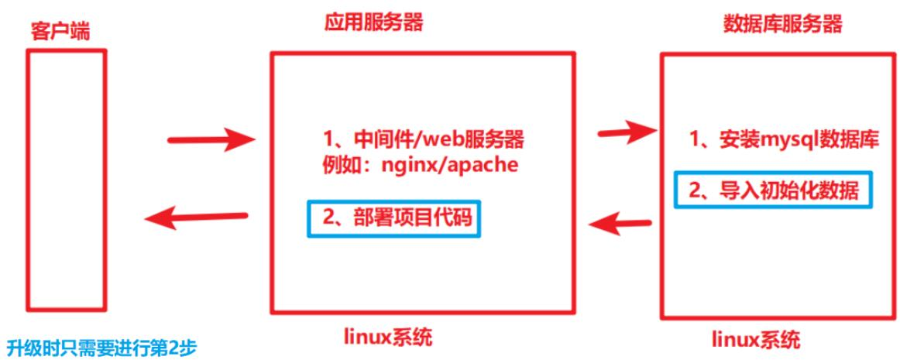
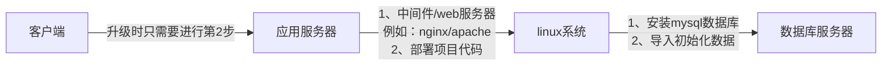
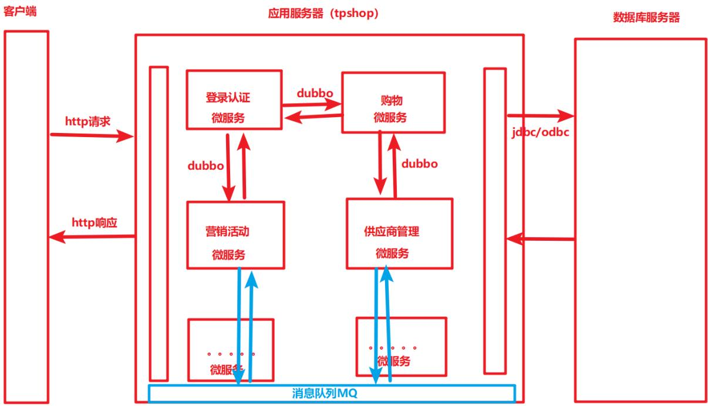
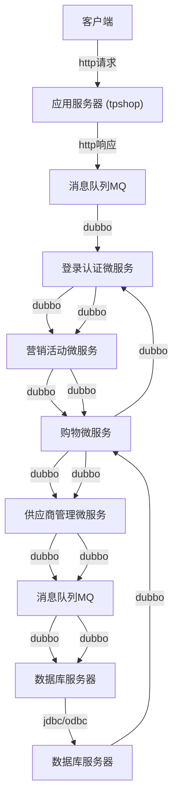
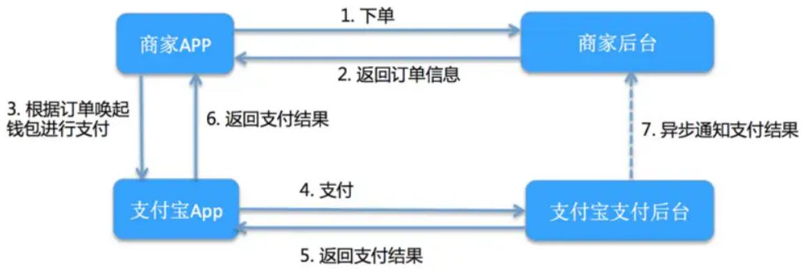
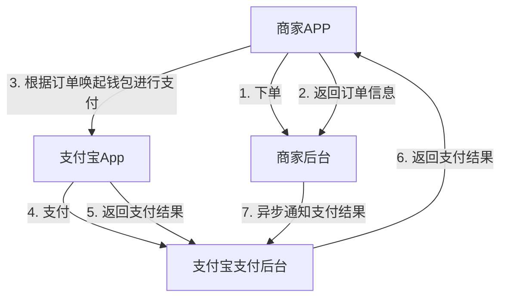
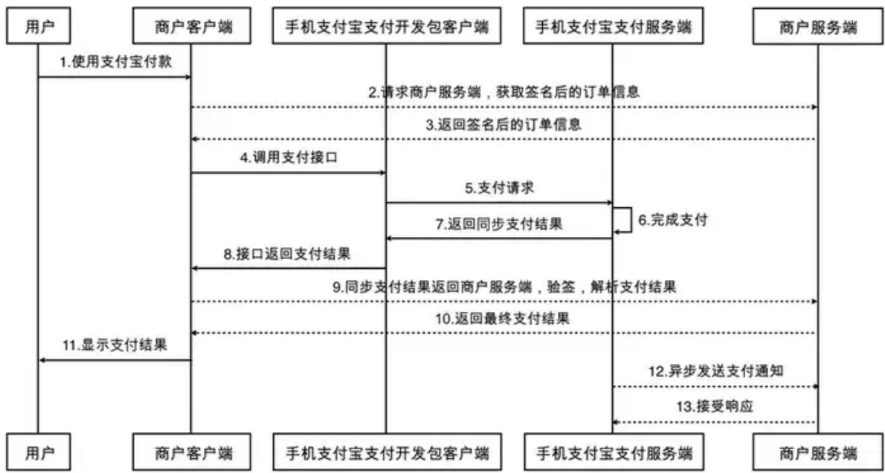
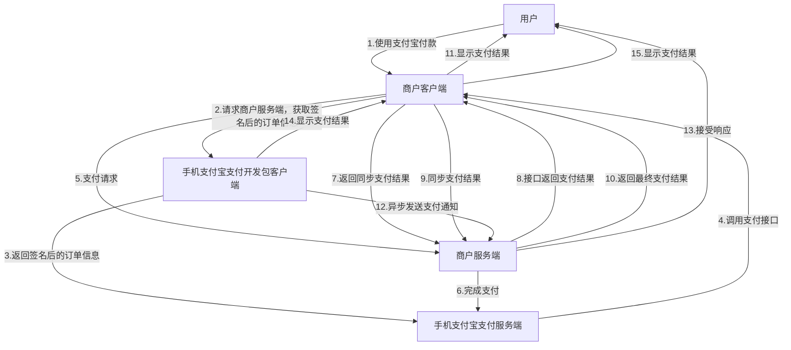

# 8, Linux在测试中都用来做什么？搭建过测试环境吗？怎么搭的？有遇到过问题吗，是怎么解决的（必会）

修改添加搭建环境的文件压缩包

- 准备linux操作系统（服务器）——找运维人员申请/找之前的测试人员要  
- 找开发提供安装手册，以及对应的所有软件包，上传到服务器上

上传软件包到服务器上的方法:

- 方式一：工具上传。打开finalshell工具，将软件包拖动到指定linux目录下，即可完成上传。  
- 方式二：命令行上传。 scp 命令拷贝文件到远程（另一台）服务器 scp 本地文件 用户名@服务器IP地址:服务器文件路径

\- 在代码(web)服务器安装nginx程序，以及部署项目代码（修改配置文件，将项目代码放到配置文件指定的工作目录下）

(1) 解压缩项目代码:

```batch
- tar -zxvf 打包文件.tar.gz -C 目标路径例如：tar -zxvf tpshop.tar.gz -C /tmp
```

（2）查看nginx配置文件中指定的工作目录：

```txt
- 查看nginx配置文件：vi /etc/nginx/conf.d/default.conf
- 查看指定的工作目录（root后的目录）：输入/root+回车
root /usr/share/nginx/html; # 文档的根(root)目录
```

（3）将项目代码放到指定的工作目录下：

```shell
- cp -R 项目代码解压目录 nginx配置文件指定的工作目录例如：cp -R /tmp/tpshop /usr/share/nginx/html
```

\- 安装数据库服务器（mysql），并导入初始数据（先创建空的数据库及表结构，再使用sql语句导入数据内容）

导入初始数据的方式:

```txt
- 方式一：先在linux下执行mysql，进入mysql命令行，再执行 source 备份文件.sql 命令导入 sql 数据
- 方式二：执行在linux下执行 mysql -uroot -p123456 数据库名 < 备份文件.sql 命令导入 sql 数据
```

\- 在客户端/浏览器上打开对应的软件，进行验证，可以正常操作

环境补充介绍：

环境搭建过程介绍：



<details>
<summary>flowchart</summary>


</details>

微服务的环境介绍：  


<details>
<summary>flowchart</summary>


</details>

# 7、已知一个接口，设计测试点？（举例说明）（必会）——案例

# 答题思路：

• 1、先介绍接口是什么，功能/规则有什么，参数项有哪几个  
• 2、再结合 功能/规则、以及参数来描述对应的测试点

\- 正向：必填、全部

\- 逆向:

■ 功能异常 —— 功能/规则有什么  
■ 数据异常 —— 参数项  
■ 参数异常 —— 参数项

回答问题必须结合自己的项目中的接口来举例。

例如：项目的患者端有一个问诊费支付的功能接口，接口参数有：支付金额amount，订单号orderID，支付方式type，备注desc，针对该接口进行测试用例的设计：

# - 单接口测试:

# - 正向:

- 只填写必填参数 金额amount，订单号orderID，支付方式type，支付成功  
- 填写所有参数 金额amount，订单号orderID，支付方式type，备注desc，支付成功  
- 支付方式选择余额支付，支付成功  
- 支付方式选择微信支付，支付成功  
- 支付方式选择支付宝支付，支付成功  
- 支付方式选择银联支付，支付成功  
- 支付方式选择医保支付，支付成功

# - 逆向:

- 支付金额amount大于上限10000元，支付失败  
- 支付金额amount值设置为0元，支付失败  
- 支付金额amount值设置为100.123元，支付失败  
- 订单超过15分钟，再进行支付，支付失败  
- 订单号状态为已支付状态，支付失败   
- 订单号不存在，支付失败  
- 订单号与支付金额不匹配，支付失败   
- 支付方式不存在，支付失败  
- 备注长度超过字符上限，支付失败  
- 数据异常。。。  
- 参数异常。。。

# - 业务流程测试:

\- 正常需要先登录，再下单，再支付

# - 逆向:

- 未登录，直接支付失败  
- 已登录，未下单，支付失败

# 7、支付接口交互逻辑和测试点补充（支付案例必看）

支付宝大致流程为：  


<details>
<summary>flowchart</summary>


</details>

APP端将订单信息提交到后台，后台通过支付宝规定的签名算法将签名信息返回给APP端，APP端调用支付宝SDK去实现支付



<details>
<summary>flowchart</summary>


</details>

# 支付实现逻辑：

如何调用微信或者支付宝的第三方接口：

我们需要对接五个接口

- 首先 商户客户端 发起支付，服务器返回签名后的订单信息，商户客户端再跳转到 第三方网站/APP 进行支付时，第三方支付公司用来校验是否合法的支付请求  
- 支付结果查询，商户用该接口来判断支付结果是否成功  
- 退款，商户用该接口进行退款   
- 退款查询，商户用该接口来判断退款结果成功与否   
- 获取支付成功订单列表接口，获取第三方某日所有成功的支付订单列表，用于对账时使用

四个流程:

# 1. 发起支付请求

\- 支付网关（服务器内部抽离的子系统）：我们将支付抽离为一个单独的系统，该系统用来对接所有支付

首先是：

发起支付（客户）- 请求支付网关（服务器）- 获取支付token（服务器）- 返回token（支付网关）- 返回支付必须参数（电商系统）- 跳转到第三方支付页面（第三方支付）

签名校验：请求支付接口域名为内网域名，使用签名校验，让系统更加安全

记录请求日志：请求除了记录到log文件中，建议落库，方便日后查找

非首次支付判断支付状态：防止重复支付，该判断可在流量高峰期降配掉

生成新的支付号：部分第三方支付公司，规定同一个支付号，无论支付成功与否只能使用一次。目前，在小米网，当订单创建成功后，订单号不会改变，所以每次用户发起支付后，支付网关会生成新的支付号，使用该支付号请求第三方。该方案会引入重复支付问题，

# 2. 同步回调和异步回调

支付后，第三方支付会通知支付网关，支付结果。通知的实现一般会有两种方案- 同步回调：支付后，立即回调支付网关提供的回调接口。该接口url一般在发起支付时，作为参数传递给第三方

\- 异步回调：支付后，第三方支付会调用对接方提供的API，该API一般是对接的时候提供给第三方，第三方配置在自己系统中的。异步回调有重试机制，如果对接方没有返回指定结果，如httpcode不为200，则会在一段时间后重试，直到达到指定重试上线后，会停止重试

日志：传入和返回数据都做记录

签名校验：校验第三方签名十分重要，这是防止他人攻击的方案之一

判断支付成功：情况允许条件下，建议请求第三方查询接口来判断是否支付成功，这是防止他人攻击的方案之二

\*\*跳转支付成功/失败页面：当发起支付时，支付成功或者失败页面的url会传给支付网关。之所以请求支付时传递该url，原因在于不同终端，url不同。\*\*

该流程需要两个定时脚本进行支撑

\*\*通知订单中心支付完成。因为更改支付系统的订单状态和通知订单中心未必会同时成功。\*\*

\*\*重复支付订单自动退款\*\*

# 3. 退款

退款整体流程一般为，财务系统向支付网关发起退款请求，支付网关将退款记录到表。支付系统定时进行退款，财务系统定时查询退款状态。

\- 退款类型：退款一般分为两种类型

\- 部分退款：有的第三方公司不支持，需要提前咨询

\- 全额退款

待退款列表：建议同一个订单的多个退款单，确认处理完一个之后，再处理另一个

退款相关状态：调用第三方接口状态callStatus，退款结果状态refundStatus。callStatus成功，refundStatus未成功，可定时查退款状态

查询退款结果：可选，根据第三方API情况做判断

日志：请求日志和返回日志都进行记录

# 4. 对账

对账的完成，需要第三方提供前一天的支付成功数据，然后和支付网关系统中当天的支付成功数据进行对比。

对不上账的类型有：

支付网关有数据，第三方没有数据：

\- 可能被黑客攻击了，用户没有真正支付，但是我们发货了

\- 代码有问题，用户没有完成支付，但是系统认为支付成功了

第三方提供数据不全:

\- 支付网关没有数据，第三方有数据

- 用户支付成功，但是同步或者异步通知都失败了  
- 金额不一致  
- 代码有问题，电商发起支付金额和真正调用第三方金额不一致  
- 第三方提供数据有问题

对账是验证支付系统准确的重要一环，可以帮助开发人员今早发现很多问题，建议每一种支付方式都要支持，并且及时对账