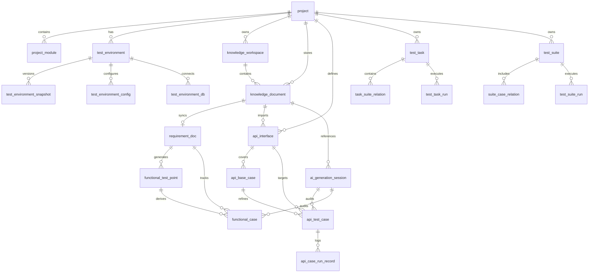

# 一、数据库表结构设计

> 本文档 v2.1 已对齐 AI 工作流、TestApiEngine、知识库管理模块。ORM 实现时建议以 Pydantic 模型为字段来源；知识库向量/图数据仍存 LightRAG 文件，MySQL 仅存元数据。

## 一、用户模块

核心功能：实现用户登录，鉴权。

### 1、用户表（user）

| 字段名         | 类型         | 约束           | 描述             |
| -------------- | ------------ | -------------- | ---------------- |
| id             | int          | PK, 自增       | 主键             |
| username       | varchar(50)  | 唯一, NOT NULL | 用户名，全局唯一 |
| email          | varchar(100) | 唯一, NOT NULL | 邮箱，全局唯一   |
| password_hash  | char(60)     | NOT NULL       | bcrypt 哈希密码  |
| is_super_admin | tinyint(1)   | 默认 0         | 超级管理员标志   |
| is_active      | tinyint(1)   | 默认 1         | 账号状态         |
| created_at     | datetime(6)  | 默认当前时间   | 创建时间         |
| updated_at     | datetime(6)  | 自动更新       | 更新时间         |

## 二、项目模块

### 1、项目表（project）

| 字段名      | 类型         | 约束           | 描述       |
| ----------- | ------------ | -------------- | ---------- |
| id          | int          | PK, 自增       | 主键       |
| name        | varchar(100) | 唯一, NOT NULL | 项目名称   |
| description | longtext     | 可空           | 项目描述   |
| owner_id    | int          | FK(user.id)    | 项目创建者快照；权限以 `project_member.role` 为准 |
| created_at  | datetime(6)  | 默认当前时间   | 创建时间   |
| updated_at  | datetime(6)  | 自动更新       | 更新时间   |

### 2、项目成员表（project_member）

| 字段名     | 类型        | 约束              | 描述                                    |
| ---------- | ----------- | ----------------- | --------------------------------------- |
| id         | int         | PK, 自增          | 主键                                    |
| project_id | int         | FK(project.id)    | 所属项目                                |
| user_id    | int         | FK(user.id)       | 用户                                    |
| role       | tinyint(1)  | 默认 1            | 成员角色（0=viewer, 1=editor, 2=owner） |
| status     | tinyint(1)  | 默认 1            | 成员状态（0=禁用, 1=启用）              |
| granted_by | int         | FK(user.id), 可空 | 授权人                                  |
| created_at | datetime(6) | 默认当前时间      | 加入时间                                |
| updated_at | datetime(6) | 自动更新          | 更新时间                                |

### 3、项目模块表（project_module）

| 字段名      | 类型         | 约束         | 描述             |
| ----------- | ------------ | ------------ | ---------------- |
| id          | int          | PK, 自增     | 主键，自增ID     |
| name        | varchar(100) | NOT NULL     | 模块名称         |
| description | longtext     | 可空         | 模块描述（可选） |
| project_id  | int          | NOT NULL, FK(project.id) | 所属项目ID |
| created_at  | datetime(6)  | 默认当前时间 | 创建时间         |
| updated_at  | datetime(6)  | 自动更新     | 更新时间         |

| **索引** | UNIQUE(project_id, name) | 同一项目下模块名称唯一 |

## 三、测试环境模块

环境数据结构与 TestApiEngine 执行引擎入参 `test_env_data` 对齐：

```python
{
  "base_url": "...",
  "headers": {...},
  "envs": {...},
  "global_func": "...",  # Python 代码字符串
  "db": [{"name", "type", "config"}]
}
```

### 1、测试环境表（test_environment）

| 字段名      | 类型        | 约束                             | 描述                                     |
| ----------- | ----------- | -------------------------------- | ---------------------------------------- |
| id          | INT         | PK, 自增                         | 主键ID                                   |
| project_id  | INT         | NOT NULL, FK(project.id)         | 所属项目ID                               |
| env_name    | VARCHAR(50) | NOT NULL                         | 环境名称，如 dev/test/staging/prod       |
| description | VARCHAR(255)| 可空                             | 环境说明                                 |
| created_at  | DATETIME(6) | 默认 CURRENT_TIMESTAMP(6)        | 创建时间                                 |
| updated_at  | DATETIME(6) | ON UPDATE CURRENT_TIMESTAMP(6)   | 更新时间                                 |

| **索引** | UNIQUE(project_id, env_name) | 同一项目下环境名称唯一 |
| **索引** | INDEX(project_id)            | 按项目查询             |

> `func_global` 已迁移至 `test_environment_config`（config_group=`global`）或 `test_environment_snapshot.payload`，避免职责重叠。

### 2、测试环境配置表（test_environment_config）

键值配置，支持标量、JSON 对象及敏感项。

| 字段名         | 类型         | 约束                                              | 描述                                   |
| -------------- | ------------ | ------------------------------------------------- | -------------------------------------- |
| id             | INT          | PK, 自增                                          | 主键ID                                 |
| environment_id | INT          | NOT NULL, FK(test_environment.id)                 | 所属测试环境ID                         |
| config_group   | VARCHAR(50)  | NOT NULL, 默认 'base'                             | 配置分组：base / headers / envs / global |
| name           | VARCHAR(100) | NOT NULL                                          | 配置项名称，如 base_url、Content-Type  |
| config_type    | ENUM('scalar','json','secret') | NOT NULL, 默认 'scalar'           | 值类型                                 |
| value          | TEXT         | 可空                                              | 配置值；json 类型存序列化 JSON 字符串  |
| created_at     | DATETIME(6)  | 默认 CURRENT_TIMESTAMP(6)                         | 创建时间                               |
| updated_at     | DATETIME(6)  | ON UPDATE CURRENT_TIMESTAMP(6)                    | 更新时间                               |

| **索引** | UNIQUE(environment_id, config_group, name) | 防止同环境、同分组、同配置项重复 |

**典型映射示例**

| config_group | name        | config_type | 说明              |
| ------------ | ----------- | ----------- | ----------------- |
| base         | base_url    | scalar      | 基础 URL          |
| headers      | Content-Type| scalar      | 公共请求头        |
| envs         | correct_username | scalar   | 环境变量          |
| global       | global_func | scalar      | 全局 Python 函数  |

### 3、测试环境数据库配置表（test_environment_db）

| 字段名         | 类型        | 约束                                  | 描述                                                         |
| -------------- | ----------- | ------------------------------------- | ------------------------------------------------------------ |
| id             | INT         | PK, 自增                              | 主键ID                                                       |
| environment_id | INT         | NOT NULL, FK(test_environment.id)     | 所属测试环境ID                                               |
| name           | VARCHAR(50) | NOT NULL, 默认 'default'              | 数据库实例标识，如 P2P/main/log                              |
| type           | VARCHAR(20) | NOT NULL                              | 数据库类型，如 mysql / redis / mongodb                       |
| config         | JSON        | 可空                                  | 连接信息 host/port/user/password/db_name；密码建议加密存储   |
| created_at     | DATETIME(6) | 默认 CURRENT_TIMESTAMP(6)             | 创建时间                                                     |
| updated_at     | DATETIME(6) | ON UPDATE CURRENT_TIMESTAMP(6)        | 更新时间                                                     |

| **索引** | UNIQUE(environment_id, name) | 防止同环境下同实例重复 |

### 4、测试环境快照表（test_environment_snapshot）

整包环境快照，供 AI 预执行与正式执行复现同一环境。

| 字段名         | 类型        | 约束                              | 描述                                              |
| -------------- | ----------- | --------------------------------- | ------------------------------------------------- |
| id             | INT         | PK, 自增                          | 主键ID                                            |
| environment_id | INT         | NOT NULL, FK(test_environment.id) | 所属环境ID                                        |
| payload        | JSON        | NOT NULL                          | 完整 test_env_data（base_url/headers/envs/global_func/db） |
| version        | INT         | NOT NULL, 默认 1                  | 快照版本号                                        |
| is_active      | TINYINT(1)  | NOT NULL, 默认 0                  | 是否为当前激活快照                                |
| created_by     | INT         | FK(user.id), 可空                 | 创建人                                            |
| created_at     | DATETIME(6) | 默认 CURRENT_TIMESTAMP(6)         | 创建时间                                          |

| **索引** | INDEX(environment_id, is_active) | 快速取激活快照 |

## 四、知识库模块

管理项目级 RAG 工作空间与文档元数据（上传、索引状态、版本）。向量/图数据仍由 LightRAG 存储于 `rag/rag_storage/`，**不入 MySQL**。

**与业务表职责分离**

| 表 | 职责 |
|----|------|
| knowledge_workspace / knowledge_document | 文件生命周期、RAG 索引状态 |
| requirement_doc | 需求正文（结构化业务数据） |
| api_interface | 接口定义（解析后的结构化数据） |

### 1、知识库工作空间表（knowledge_workspace）

项目级 RAG workspace，对齐代码中 `RAGManager.init_rag(project_name)` 与 `RAGClient` 双通道。

| 字段名        | 类型         | 约束                              | 描述 |
| ------------- | ------------ | --------------------------------- | ---- |
| id            | INT          | PK, 自增                          | 主键ID |
| project_id    | INT          | NOT NULL, FK(project.id)          | 所属项目ID |
| workspace_key | VARCHAR(100) | NOT NULL                          | 目录名，默认等于项目标识，对应 `rag/rag_storage/{workspace_key}` |
| rag_type      | ENUM('requirement','api') | NOT NULL               | requirement=需求 RAG（RAGManager）；api=接口 RAG（RAGClient） |
| storage_path  | VARCHAR(500) | 可空                              | 自定义存储根路径；空则使用默认 `rag/rag_storage/{workspace_key}` |
| is_active     | TINYINT(1)   | NOT NULL, 默认 1                  | 是否启用 |
| created_at    | DATETIME(6)  | 默认 CURRENT_TIMESTAMP(6)         | 创建时间 |
| updated_at    | DATETIME(6)  | ON UPDATE CURRENT_TIMESTAMP(6)    | 更新时间 |

| **索引** | UNIQUE(project_id, rag_type) | 每项目每种 RAG 类型一个 workspace |

### 2、知识库文档表（knowledge_document）

文档上传与 RAG 索引元数据。

| 字段名                | 类型         | 约束                              | 描述 |
| --------------------- | ------------ | --------------------------------- | ---- |
| id                    | INT          | PK, 自增                          | 主键ID |
| project_id            | INT          | NOT NULL, FK(project.id)          | 所属项目ID |
| module_id             | INT          | FK(project_module.id), 可空       | 所属模块ID |
| workspace_id          | INT          | NOT NULL, FK(knowledge_workspace.id) | 所属 workspace |
| doc_type              | ENUM('requirement','api_doc','other') | NOT NULL            | 文档类型 |
| title                 | VARCHAR(255) | NOT NULL                          | 展示标题 |
| file_name             | VARCHAR(255) | NOT NULL                          | 原始文件名 |
| file_path             | VARCHAR(500) | NOT NULL                          | 存储路径（本地或对象存储 key） |
| file_hash             | CHAR(64)     | 可空                              | SHA-256，用于去重与变更检测 |
| mime_type             | VARCHAR(100) | 可空                              | MIME 类型 |
| file_size             | BIGINT       | 可空                              | 文件大小（字节） |
| version               | INT          | NOT NULL, 默认 1                  | 文档版本号 |
| index_status          | ENUM('pending','indexing','indexed','failed') | NOT NULL, 默认 'pending' | RAG 索引状态 |
| index_error           | TEXT         | 可空                              | 索引失败原因 |
| indexed_at            | DATETIME(6)  | 可空                              | 最近索引成功时间 |
| linked_requirement_id | INT          | FK(requirement_doc.id), 可空      | 同步生成的需求记录 |
| created_by            | INT          | FK(user.id), 可空                 | 上传人 |
| created_at            | DATETIME(6)  | 默认 CURRENT_TIMESTAMP(6)         | 创建时间 |
| updated_at            | DATETIME(6)  | ON UPDATE CURRENT_TIMESTAMP(6)    | 更新时间 |

| **索引** | INDEX(project_id, doc_type, index_status) | 文档列表筛选 |
| **索引** | INDEX(workspace_id, file_hash)          | 同 workspace 去重 |

**典型数据流**

- 上传需求 Markdown/PDF → `knowledge_document` → LightRAG 索引 → 可选 sync → `requirement_doc`（`source_document_id` 回指）
- 上传 swagger.json → `knowledge_document` → 解析 → 批量写入 `api_interface`（`source_document_id` 相同）

## 五、功能测试模块

### 1、需求表（requirement_doc）

| 字段名      | 数据类型                                                  | 必填 | 默认值                                              | 描述                            | 备注                           |
| ----------- | --------------------------------------------------------- | ---- | --------------------------------------------------- | ------------------------------- | ------------------------------ |
| id          | INT AUTO_INCREMENT                                        | 是   | 无                                                  | 主键ID                          | 唯一标识一条需求记录           |
| project_id  | INT                                                       | 是   | 无                                                  | 所属项目ID                      | 外键，关联 `project.id`        |
| module_id   | INT                                                       | 否   | NULL                                                | 所属模块ID                      | 外键，关联 `project_module.id` |
| title       | VARCHAR(255)                                              | 是   | 无                                                  | 需求标题                        | 文档的展示名称                 |
| doc_no      | VARCHAR(100)                                              | 否   | NULL                                                | 需求编号                        | UNIQUE(module_id, doc_no)      |
| description | LONGTEXT                                                  | 否   | NULL                                                | 需求详细描述（Markdown/富文本） | 用于保存需求正文               |
| priority    | TINYINT                                                   | 是   | 3                                                   | 优先级                          | 1=紧急, 2=高, 3=中, 4=低       |
| status      | ENUM('draft','reviewing','approved','rejected','changed') | 是   | 'draft'                                             | 状态                            | 需求当前状态                   |
| source_document_id | INT                                                | 否   | NULL                                                | 来源知识库文档ID                | 外键，关联 `knowledge_document.id` |
| index_status | ENUM('pending','indexing','indexed','failed','na')       | 否   | 'na'                                                | RAG 索引状态                    | na=手工录入无需索引            |
| indexed_at  | DATETIME(6)                                               | 否   | NULL                                                | 最近索引成功时间                | 与 knowledge_document 同步     |
| created_by  | INT                                                       | 是   | 无                                                  | 创建人ID                        | 外键，关联 `user.id`           |
| created_at  | DATETIME(6)                                               | 是   | CURRENT_TIMESTAMP(6)                                | 创建时间                        | 自动生成                       |
| updated_at  | DATETIME(6)                                               | 是   | CURRENT_TIMESTAMP(6) ON UPDATE CURRENT_TIMESTAMP(6) | 更新时间                        | 自动记录最近一次更新时间       |

### 2、功能测试点表（functional_test_point）

AI 工作流中间产物，对齐 `TestPointModel`（type / dimension / test_point）。

| 字段名         | 数据类型     | 必填 | 默认值               | 描述           | 备注                          |
| -------------- | ------------ | ---- | -------------------- | -------------- | ----------------------------- |
| id             | INT          | 是   | 无                   | 主键ID         | 自增                          |
| requirement_id | INT          | 是   | 无                   | 关联需求ID     | 外键，关联 `requirement_doc.id` |
| type           | VARCHAR(50)  | 是   | 无                   | 用例类型       | 对齐 AI 输出                  |
| dimension      | VARCHAR(100) | 是   | 无                   | 测试维度       | 对齐 AI 输出                  |
| test_point     | TEXT         | 是   | 无                   | 测试点描述     |                               |
| source         | ENUM('manual','ai') | 是 | 'ai'              | 来源           |                               |
| generation_session_id | INT   | 否   | NULL                 | AI 生成会话ID  | 外键，关联 `ai_generation_session.id` |
| created_at     | DATETIME(6)  | 是   | CURRENT_TIMESTAMP(6) | 创建时间       |                               |

### 3、功能用例表（functional_case）

| 字段名                | 数据类型                                               | 必填 | 默认值                                              | 描述         | 备注                          |
| --------------------- | ------------------------------------------------------ | ---- | --------------------------------------------------- | ------------ | ----------------------------- |
| id                    | INT AUTO_INCREMENT                                     | 是   | 无                                                  | 用例ID       | 主键                          |
| project_id            | INT                                                    | 是   | 无                                                  | 所属项目ID   | 外键，关联 `project.id`       |
| module_id             | INT                                                    | 否   | NULL                                                | 所属模块ID   | 外键；与 requirement_id 至少其一 |
| requirement_id        | INT                                                    | 否   | NULL                                                | 关联需求ID   | 外键，关联 `requirement_doc.id` |
| test_point_id         | INT                                                    | 否   | NULL                                                | 来源测试点ID | 外键，关联 `functional_test_point.id` |
| case_no               | VARCHAR(100)                                           | 否   | NULL                                                | 用例编号     | 对齐 AI 字段 case_id          |
| case_name             | VARCHAR(255)                                           | 是   | 无                                                  | 用例名称     |                               |
| priority              | TINYINT                                                | 是   | 3                                                   | 优先级       | 1=P0, 2=P1, 3=P2, 4=P3        |
| dimension             | VARCHAR(100)                                           | 否   | NULL                                                | 测试维度     | 对齐 AI 输出                  |
| type                  | ENUM('functional','ui')                                | 是   | 'functional'                                        | 用例类型     |                               |
| status                | ENUM('design','ready','smoke','regression','obsolete') | 是   | 'design'                                            | 当前状态     |                               |
| content_format        | ENUM('text','json')                                    | 是   | 'text'                                              | 步骤/数据格式 | text=LLM 自然语言；json=结构化 |
| preconditions         | TEXT                                                   | 否   | NULL                                                | 前置步骤     |                               |
| test_steps            | TEXT                                                   | 否   | NULL                                                | 测试步骤     | text 或 JSON 字符串           |
| test_data             | TEXT                                                   | 否   | NULL                                                | 输入数据     | text 或 JSON 字符串           |
| expected_result       | TEXT                                                   | 否   | NULL                                                | 预期结果     |                               |
| actual_result         | TEXT                                                   | 否   | NULL                                                | 实际结果     | 测试执行后填写                |
| source                | ENUM('manual','ai')                                    | 是   | 'manual'                                            | 来源         |                               |
| generation_session_id | INT                                                    | 否   | NULL                                                | AI 生成会话ID | 外键，关联 `ai_generation_session.id` |
| created_by            | INT                                                    | 是   | 无                                                  | 创建人ID     | 外键，关联 `user.id`          |
| created_at            | DATETIME(6)                                            | 是   | CURRENT_TIMESTAMP(6)                                | 创建时间     | 自动生成                      |
| updated_at            | DATETIME(6)                                            | 是   | CURRENT_TIMESTAMP(6) ON UPDATE CURRENT_TIMESTAMP(6) | 更新时间     | 自动更新                      |

## 六、接口测试模块

### 1、接口表（api_interface）

对齐 `APIDocumentParserModel`（path / method / summary / parameters / requestBody / responses）。

| 字段名       | 数据类型           | 必填 | 默认值               | 描述         | 备注                              |
| ------------ | ------------------ | ---- | -------------------- | ------------ | --------------------------------- |
| id           | INT AUTO_INCREMENT | 是   | 无                   | 主键ID，自增 |                                   |
| project_id   | INT                | 是   | 无                   | 所属项目ID   | 外键，关联 `project.id`           |
| module_id    | INT                | 否   | NULL                 | 所属模块ID   | 外键，关联 `project_module.id`    |
| method       | VARCHAR(10)        | 是   | 无                   | HTTP 请求方法 | GET/POST/PUT/DELETE/PATCH 等    |
| path         | VARCHAR(255)       | 是   | 无                   | 接口路径     | 必须以 / 开头                     |
| summary      | VARCHAR(255)       | 否   | NULL                 | 接口简要说明 | 用于 dependencies 依赖名匹配      |
| parameters   | JSON               | 是   | 无                   | 参数说明     | header/path/query 分类            |
| request_body | JSON               | 否   | NULL                 | 请求体结构   | 无请求体时为 null                 |
| responses    | JSON               | 是   | 无                   | 响应体结构   |                                   |
| source       | ENUM('swagger','openapi','rag','manual') | 是 | 'manual' | 来源         |                                   |
| source_document_id | INT          | 否   | NULL                 | 来源知识库文档ID | 外键，关联 `knowledge_document.id`；OpenAPI 批量导入时相同 |
| version      | INT                | 是   | 1                    | 版本号       | 接口变更递增                      |
| created_at   | DATETIME(6)        | 是   | CURRENT_TIMESTAMP(6) | 创建时间     |                                   |
| updated_at   | DATETIME(6)        | 是   | CURRENT_TIMESTAMP(6) ON UPDATE CURRENT_TIMESTAMP(6) | 更新时间 | |

| **索引** | UNIQUE(project_id, method, path, version) | 项目内接口唯一（含版本） |
| **索引** | INDEX(project_id, summary)              | 按 summary 查前置依赖    |

### 2、依赖组表（api_dependency_group）

| 字段名      | 数据类型           | 必填 | 默认值               | 描述                  | 备注                    |
| ----------- | ------------------ | ---- | -------------------- | --------------------- | ----------------------- |
| id          | INT AUTO_INCREMENT | 是   | 无                   | 依赖组ID              | 主键，自增              |
| name        | VARCHAR(100)       | 是   | 无                   | 依赖组名称/调用链名称 | 业务流程名称            |
| project_id  | INT                | 是   | 无                   | 所属项目ID            | 外键，关联 `project.id` |
| module_id   | INT                | 否   | NULL                 | 所属模块ID            | 外键，关联 `project_module.id` |
| description | TEXT               | 否   | NULL                 | 依赖组描述            | 说明该依赖链的用途      |
| created_by  | INT                | 否   | NULL                 | 创建人                | 外键，关联 `user.id`    |
| created_at  | DATETIME(6)        | 是   | CURRENT_TIMESTAMP(6) | 创建时间              | 自动生成                |
| updated_at  | DATETIME(6)        | 是   | CURRENT_TIMESTAMP(6) ON UPDATE CURRENT_TIMESTAMP(6) | 更新时间 | 自动更新 |

- 每条业务流程或接口调用链对应一个 `dependency_group`。
- 可以包含多个接口依赖，形成一条完整的依赖链。
- 短期 AI 生成场景可仅使用 `api_base_case.dependencies` JSON 数组；本表用于可视化编排与长期维护。

### 3、接口依赖表（api_dependency）

| 字段名              | 数据类型           | 必填 | 默认值               | 描述             | 备注                                   |
| ------------------- | ------------------ | ---- | -------------------- | ---------------- | -------------------------------------- |
| id                  | INT AUTO_INCREMENT | 是   | 无                   | 主键ID           | 自增                                   |
| dependency_group_id | INT                | 是   | 无                   | 所属依赖组ID     | 外键，关联 `api_dependency_group.id`   |
| from_api_id         | INT                | 是   | 无                   | 起始接口ID       | 外键，关联 `api_interface.id`          |
| to_api_id           | INT                | 是   | 无                   | 被依赖接口ID     | 外键，关联 `api_interface.id`          |
| seq                 | TINYINT            | 是   | 1                    | 同一组内执行顺序 | 用于确定接口调用顺序                   |
| param_map           | JSON               | 否   | NULL                 | 参数映射关系     | JSON 格式 {"targetField":"sourceField"} |
| required            | TINYINT(1)         | 是   | 1                    | 是否必须         | 0=可选, 1=必须                         |
| created_at          | DATETIME(6)        | 是   | CURRENT_TIMESTAMP(6) | 创建时间         | 自动生成                               |

### 4、基础用例表（api_base_case）

对齐 `BaseCaseModel`（name / steps / dependencies / expected）。

| 字段名                | 数据类型           | 必填 | 默认值               | 描述           | 备注                              |
| --------------------- | ------------------ | ---- | -------------------- | -------------- | --------------------------------- |
| id                    | INT AUTO_INCREMENT | 是   | 无                   | 主键ID，自增   |                                   |
| project_id            | INT                | 是   | 无                   | 所属项目ID     | 外键，关联 `project.id`           |
| interface_id          | INT                | 是   | 无                   | 关联接口ID     | 外键，关联 `api_interface.id`     |
| name                  | VARCHAR(255)       | 是   | 无                   | 测试用例名称   |                                   |
| steps                 | JSON               | 是   | 无                   | 测试步骤列表   | JSON 字符串数组                   |
| dependencies          | JSON               | 否   | NULL                 | 前置依赖接口名 | 对齐 BaseCaseModel.dependencies   |
| expected              | JSON               | 是   | 无                   | 预期结果列表   | JSON 字符串数组                   |
| status                | ENUM('draft','approved','archived') | 是 | 'draft' | 用例状态       |                                   |
| source                | ENUM('manual','ai') | 是  | 'ai'                 | 来源           |                                   |
| generation_session_id | INT                | 否   | NULL                 | AI 生成会话ID  | 外键，关联 `ai_generation_session.id` |
| created_by            | INT                | 是   | 无                   | 创建人ID       | 外键，关联 `user.id`              |
| created_at            | DATETIME(6)        | 是   | CURRENT_TIMESTAMP(6) | 创建时间       |                                   |
| updated_at            | DATETIME(6)        | 是   | CURRENT_TIMESTAMP(6) ON UPDATE CURRENT_TIMESTAMP(6) | 更新时间 | |

### 5、API 可执行测试用例表（api_test_case）

对齐 `APIruncaseModel` 与 TestApiEngine 单条用例结构。采用 **检索列 + case_payload JSON** 混合存储。

**case_payload 结构示例**（与 `test_data/api_run_cases.json` 一致）：

```json
{
  "description": "...",
  "interface": {"interface_id": "...", "name": "...", "url": "...", "method": "POST"},
  "headers": {"Content-Type": "application/x-www-form-urlencoded"},
  "request": {"params": {}, "data": {}, "json": {}, "files": {}},
  "preconditions": [],
  "setup_script": "",
  "teardown_script": "",
  "extract": [{"var_name": "status", "extract_expr": "$.status"}],
  "assertions": [{"type": "相等", "field": "$.status", "expected": 200}]
}
```

| 字段名                | 数据类型                                      | 必填 | 默认值                                              | 描述               | 备注                                                        |
| --------------------- | --------------------------------------------- | ---- | --------------------------------------------------- | ------------------ | ----------------------------------------------------------- |
| id                    | INT                                           | 是   | 无                                                  | 自增主键ID         |                                                             |
| project_id            | INT                                           | 是   | 无                                                  | 所属项目ID         | 外键，关联 `project.id`                                     |
| module_id             | INT                                           | 否   | NULL                                                | 所属模块ID         | 外键，关联 `project_module.id`                              |
| base_case_id          | INT                                           | 否   | NULL                                                | 关联基础用例ID     | 外键，关联 `api_base_case.id`                               |
| interface_id          | INT                                           | 否   | NULL                                                | 主接口ID           | 外键，关联 `api_interface.id`；从 case_payload.interface 拆出 |
| title                 | VARCHAR(255)                                  | 是   | 无                                                  | 用例名称           | 对齐代码字段 title                                          |
| case_payload          | JSON                                          | 是   | 无                                                  | 完整可执行用例体   | headers/request/preconditions/extract/assertions/scripts 等 |
| type                  | ENUM('api','business')                        | 是   | 'api'                                               | 用例类型           | api=接口用例，business=业务流用例                           |
| review_status         | ENUM('init','success','fail','error')         | 是   | 'init'                                              | AI 预执行状态      | 对齐 workflow review_status                                 |
| exec_status           | ENUM('pending','ready','disabled')            | 是   | 'pending'                                           | 人工审核后可执行态 | pending=待审核, ready=可执行, disabled=禁用                 |
| generation_count      | INT                                           | 是   | 1                                                   | 生成/重试次数      | 对齐 workflow generator_count                               |
| environment_id        | INT                                           | 否   | NULL                                                | 生成验证时使用的环境 | 外键，关联 `test_environment.id`                          |
| env_snapshot_id       | INT                                           | 否   | NULL                                                | 环境快照ID         | 外键，关联 `test_environment_snapshot.id`                   |
| generation_session_id | INT                                           | 否   | NULL                                                | AI 生成会话ID      | 外键，关联 `ai_generation_session.id`                       |
| last_run_at           | DATETIME(6)                                   | 否   | NULL                                                | 最近预执行时间     |                                                             |
| created_by            | INT                                           | 是   | 无                                                  | 创建人ID           | 外键，关联 `user.id`                                        |
| created_at            | DATETIME(6)                                   | 是   | CURRENT_TIMESTAMP(6)                                | 创建时间           | 自动生成                                                    |
| updated_at            | DATETIME(6)                                   | 是   | CURRENT_TIMESTAMP(6) ON UPDATE CURRENT_TIMESTAMP(6) | 更新时间           | 自动更新                                                    |

| **索引** | INDEX(project_id, module_id, exec_status) | 列表筛选     |
| **索引** | INDEX(interface_id)                       | 按接口查用例 |

## 七、测试管理模块

### 1、测试任务表（test_task）

- 描述一个测试任务（比如「回归测试任务 #1」）。
- 包含多个测试套件。

| 字段名      | 数据类型                                       | 必填 | 描述                  |
| ----------- | ---------------------------------------------- | ---- | --------------------- |
| id          | INT                                            | 是   | 主键ID                |
| project_id  | INT                                            | 是   | 所属项目ID，FK(project.id) |
| task_name   | VARCHAR(255)                                   | 是   | 任务名称              |
| description | TEXT                                           | 否   | 任务描述              |
| type        | ENUM('api','functional','ui')                  | 是   | 任务类型              |
| status      | ENUM('pending','running','completed','failed') | 是   | 任务状态              |
| created_by  | INT                                            | 否   | 创建人，FK(user.id)   |
| created_at  | DATETIME(6)                                    | 是   | 创建时间              |
| updated_at  | DATETIME(6)                                    | 是   | 更新时间              |

### 2、测试套件表（test_suite）

- 描述一个套件（比如「用户登录模块回归套件」）。
- 可以独立运行，也可以被任务包含。
- 一个套件包含多个用例（API 或功能用例）。

| 字段名      | 数据类型                      | 必填 | 描述                  |
| ----------- | ----------------------------- | ---- | --------------------- |
| id          | INT                           | 是   | 主键ID                |
| project_id  | INT                           | 是   | 所属项目ID，FK(project.id) |
| suite_name  | VARCHAR(255)                  | 是   | 套件名称              |
| description | TEXT                          | 否   | 套件描述              |
| type        | ENUM('api','functional','ui') | 是   | 套件类型              |
| created_by  | INT                           | 否   | 创建人，FK(user.id)   |
| created_at  | DATETIME(6)                   | 是   | 创建时间              |
| updated_at  | DATETIME(6)                   | 是   | 更新时间              |

### 3、套件-用例关系表（suite_case_relation）

多态关联，支持 API 可执行用例与功能用例。

| 字段名     | 数据类型                      | 必填 | 描述                                      |
| ---------- | ----------------------------- | ---- | ----------------------------------------- |
| id         | INT                           | 是   | 主键ID                                    |
| suite_id   | INT                           | 是   | 外键 → `test_suite.id`                    |
| case_type  | ENUM('api','functional')      | 是   | 用例类型                                  |
| case_id    | INT                           | 是   | 用例ID；api → `api_test_case.id`，functional → `functional_case.id` |
| case_order | INT                           | 是   | 用例执行顺序                              |

| **索引** | UNIQUE(suite_id, case_type, case_id) | 防止重复加入 |

### 4、任务-套件关系表（task_suite_relation）

| 字段名      | 数据类型 | 必填 | 描述                   |
| ----------- | -------- | ---- | ---------------------- |
| id          | INT      | 是   | 主键ID                 |
| task_id     | INT      | 是   | 外键 → `test_task.id`  |
| suite_id    | INT      | 是   | 外键 → `test_suite.id` |
| suite_order | INT      | 是   | 套件执行顺序           |

## 八、测试执行模块

### 1、API 用例运行记录表（api_case_run_record）

对齐 TestApiEngine `TestResult` 单条用例结果。

| 字段名            | 数据类型                              | 必填 | 默认值               | 描述                | 备注                                                         |
| ----------------- | ------------------------------------- | ---- | -------------------- | ------------------- | ------------------------------------------------------------ |
| id                | INT                                   | 是   | 无                   | 主键ID              | 自增                                                         |
| suite_run_id      | INT                                   | 否   | NULL                 | 所属套件运行记录 ID | 外键，关联 `test_suite_run.id`                               |
| api_case_id       | INT                                   | 是   | 无                   | 可执行用例ID        | 外键，关联 `api_test_case.id`                                |
| environment_id    | INT                                   | 否   | NULL                 | 执行环境ID          | 外键，关联 `test_environment.id`                             |
| env_snapshot_id   | INT                                   | 否   | NULL                 | 环境快照ID          | 外键，关联 `test_environment_snapshot.id`                    |
| case_name         | VARCHAR(255)                          | 是   | 无                   | 用例名称            | 对齐 TestResult.name                                         |
| status            | ENUM('success','fail','error')        | 是   | 无                   | 执行结果状态        | 对齐 TestResult.status                                       |
| case_snapshot     | JSON                                  | 否   | NULL                 | 执行时用例快照      | 防止用例后续修改导致报告不一致                               |
| error_message     | TEXT                                  | 否   | NULL                 | 错误信息            |                                                              |
| traceback         | TEXT                                  | 否   | NULL                 | 异常堆栈            |                                                              |
| start_time        | DATETIME(6)                           | 否   | NULL                 | 执行开始时间        |                                                              |
| end_time          | DATETIME(6)                           | 否   | NULL                 | 执行结束时间        |                                                              |
| duration_ms       | INT                                   | 否   | NULL                 | 执行时长（毫秒）    | 对齐 TestResult.run_time                                     |
| log_data          | LONGTEXT                              | 否   | NULL                 | 执行日志            | 对齐 TestResult.log_data                                     |
| api_requests_info | JSON                                  | 否   | NULL                 | 接口请求信息列表    | 数组；含 url/method/headers/request/response；前置链多请求   |
| created_at        | DATETIME(6)                           | 是   | CURRENT_TIMESTAMP(6) | 创建时间            | 自动生成                                                     |

**api_requests_info 单项建议 schema**

```json
{
  "name": "用例/步骤名",
  "url": "...",
  "method": "POST",
  "request_headers": {},
  "request_body": {},
  "response_code": 200,
  "response_headers": {},
  "response_body": {},
  "status": "success",
  "run_time": 120
}
```

### 2、API 测试套件运行记录表（test_suite_run）

| 字段名          | 数据类型                                       | 必填 | 默认值                                              | 描述               | 备注                     |
| --------------- | ---------------------------------------------- | ---- | --------------------------------------------------- | ------------------ | ------------------------ |
| id              | INT                                            | 是   | 无                                                  | 主键ID             | 自增                     |
| suite_id        | INT                                            | 是   | 无                                                  | 所属套件ID         | 外键，关联 `test_suite.id` |
| run_task_id     | INT                                            | 否   | NULL                                                | 所属任务运行ID     | 外键，关联 `test_task_run.id` |
| environment_id  | INT                                            | 否   | NULL                                                | 执行环境ID         | 外键，关联 `test_environment.id` |
| env_snapshot_id | INT                                            | 否   | NULL                                                | 环境快照ID         | 外键，关联 `test_environment_snapshot.id` |
| triggered_by    | INT                                            | 否   | NULL                                                | 触发人             | 外键，关联 `user.id`     |
| status          | ENUM('pending','running','completed','failed') | 是   | 'pending'                                           | 套件执行状态       |                          |
| total_cases     | INT                                            | 是   | 0                                                   | 套件包含的总用例数 |                          |
| passed_cases    | INT                                            | 是   | 0                                                   | 执行通过的用例数   |                          |
| failed_cases    | INT                                            | 是   | 0                                                   | 执行失败的用例数   |                          |
| error_cases     | INT                                            | 是   | 0                                                   | 执行异常的用例数   | 对齐 TestRunner error 计数 |
| skipped_cases   | INT                                            | 是   | 0                                                   | 被跳过的用例数     |                          |
| start_time      | DATETIME(6)                                    | 否   | NULL                                                | 套件执行开始时间   |                          |
| end_time        | DATETIME(6)                                    | 否   | NULL                                                | 套件执行结束时间   |                          |
| duration_ms     | INT                                            | 否   | NULL                                                | 执行时长（毫秒）   |                          |
| created_at      | DATETIME(6)                                    | 是   | CURRENT_TIMESTAMP(6)                                | 创建时间           | 自动生成                 |
| updated_at      | DATETIME(6)                                    | 是   | CURRENT_TIMESTAMP(6) ON UPDATE CURRENT_TIMESTAMP(6) | 更新时间           | 自动更新                 |

### 3、API 测试任务运行记录表（test_task_run）

| 字段名          | 数据类型                                       | 必填 | 默认值                                              | 描述               | 备注                    |
| --------------- | ---------------------------------------------- | ---- | --------------------------------------------------- | ------------------ | ----------------------- |
| id              | INT                                            | 是   | 无                                                  | 主键ID             | 自增                    |
| task_id         | INT                                            | 是   | 无                                                  | 所属任务ID         | 外键，关联 `test_task.id` |
| environment_id  | INT                                            | 否   | NULL                                                | 执行环境ID         | 外键，关联 `test_environment.id` |
| env_snapshot_id | INT                                            | 否   | NULL                                                | 环境快照ID         | 外键，关联 `test_environment_snapshot.id` |
| triggered_by    | INT                                            | 否   | NULL                                                | 触发人             | 外键，关联 `user.id`    |
| status          | ENUM('pending','running','completed','failed') | 是   | 'pending'                                           | 任务执行状态       |                         |
| total_suites    | INT                                            | 是   | 0                                                   | 任务包含的总套件数 |                         |
| total_cases     | INT                                            | 是   | 0                                                   | 任务包含的总用例数 |                         |
| passed_cases    | INT                                            | 是   | 0                                                   | 执行通过的用例数   |                         |
| failed_cases    | INT                                            | 是   | 0                                                   | 执行失败的用例数   |                         |
| error_cases     | INT                                            | 是   | 0                                                   | 执行异常的用例数   |                         |
| skipped_cases   | INT                                            | 是   | 0                                                   | 被跳过的用例数     |                         |
| start_time      | DATETIME(6)                                    | 否   | NULL                                                | 任务执行开始时间   |                         |
| end_time        | DATETIME(6)                                    | 否   | NULL                                                | 任务执行结束时间   |                         |
| duration_ms     | INT                                            | 否   | NULL                                                | 执行时长（毫秒）   |                         |
| created_at      | DATETIME(6)                                    | 是   | CURRENT_TIMESTAMP(6)                                | 创建时间           | 自动生成                |
| updated_at      | DATETIME(6)                                    | 是   | CURRENT_TIMESTAMP(6) ON UPDATE CURRENT_TIMESTAMP(6) | 更新时间           | 自动更新                |

## 九、AI 用例生成模块

生成结果仍主要写入各用例表；另增轻量审计表用于追溯、重试与版本对比。

### 1、AI 生成会话表（ai_generation_session）

| 字段名       | 数据类型                                      | 必填 | 默认值               | 描述           | 备注                                      |
| ------------ | --------------------------------------------- | ---- | -------------------- | -------------- | ----------------------------------------- |
| id           | INT                                           | 是   | 无                   | 主键ID         | 自增                                      |
| project_id   | INT                                           | 是   | 无                   | 所属项目ID     | 外键，关联 `project.id`                   |
| module_id    | INT                                           | 否   | NULL                 | 所属模块ID     | 外键，关联 `project_module.id`            |
| gen_type     | ENUM('functional','api_base','api_runnable')  | 是   | 无                   | 生成类型       | functional=功能用例；api_base=基础接口用例；api_runnable=可执行接口用例 |
| input_ref_type | ENUM('requirement','interface','api_doc')   | 否   | NULL                 | 输入引用类型   |                                           |
| input_ref_id | INT                                           | 否   | NULL                 | 输入引用ID     | requirement_id 或 interface_id 等         |
| knowledge_document_id | INT                                  | 否   | NULL                 | 引用的知识库文档ID | 外键，关联 `knowledge_document.id`    |
| model_name   | VARCHAR(100)                                  | 否   | NULL                 | 使用的大模型   | 如 gpt-4 / deepseek 等                    |
| prompt_hash  | CHAR(64)                                      | 否   | NULL                 | 提示词哈希     | 用于去重与审计，不存完整 prompt           |
| status       | ENUM('pending','running','success','failed')  | 是   | 'pending'            | 会话状态       |                                           |
| error_message| TEXT                                          | 否   | NULL                 | 失败原因       |                                           |
| created_by   | INT                                           | 是   | 无                   | 创建人ID       | 外键，关联 `user.id`                      |
| created_at   | DATETIME(6)                                   | 是   | CURRENT_TIMESTAMP(6) | 创建时间       |                                           |
| finished_at  | DATETIME(6)                                   | 否   | NULL                 | 完成时间       |                                           |

**关联关系**

- `functional_test_point.generation_session_id` → 本表
- `functional_case.generation_session_id` → 本表
- `api_base_case.generation_session_id` → 本表
- `api_test_case.generation_session_id` → 本表

## 十、表关系总览



## 十一、与代码衔接说明

| 代码位置 | 入库目标 |
| -------- | -------- |
| `rag/ragManager.py` → init_rag(project_name) | `knowledge_workspace`（rag_type=requirement, workspace_key=project_name） |
| `rag/rag_api.py` → RAGClient | `knowledge_workspace`（rag_type=api） |
| 文档上传 API（Phase2） | `knowledge_document` → 触发 LightRAG 索引 |
| `mcp_tools/tools.py` → search_requirement | 读 `knowledge_workspace` + 已 indexed 的 `knowledge_document` |
| `mcp_tools/tools.py` → search_api_document | 同上（rag_type=api） |
| `workflow/case_generator_workflow.py` → TestPointModel | `functional_test_point` |
| `workflow/case_generator_workflow.py` → TestCaseModel | `functional_case` |
| `workflow/api_basecase_workflow.py` → BaseCaseModel | `api_base_case` |
| `workflow/api_runcase_workflow.py` → APIruncaseModel | `api_test_case`（title + case_payload + review_status + generation_count） |
| `workflow/api_case_main_workflow.py` → save_api_runcase_to_db | bulk insert `api_test_case`，关联 `ai_generation_session` |
| `mcp_tools/tools.py` → load_evn_data | 改读 `test_environment` + config/db/snapshot 组装 test_env_data |
| `ApiEngine/testResult.py` | `api_case_run_record` + `test_suite_run` / `test_task_run` |

**Phase1 说明**：当前代码仍使用 `rag/rag_storage/{project}/` 文件目录，可不建表；Phase2 平台化上传/管理文档时启用本模块表结构。
